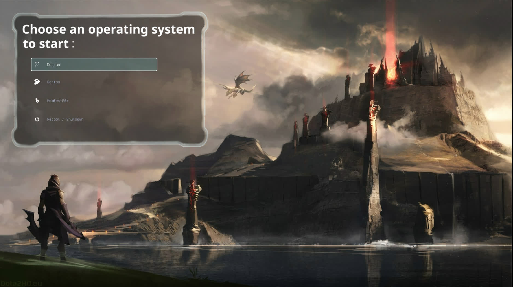
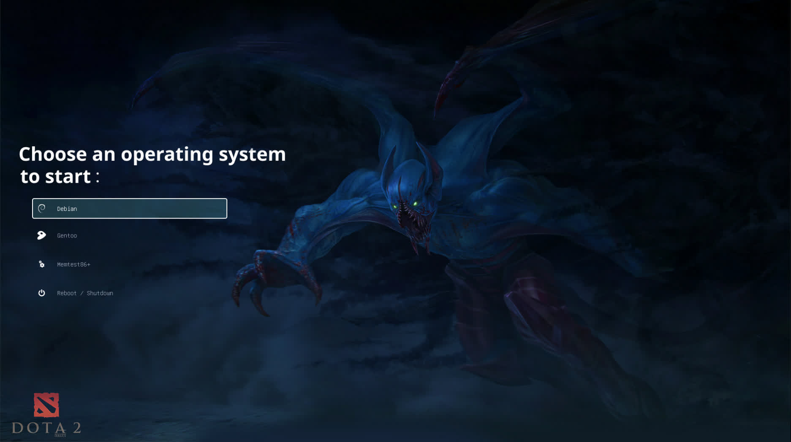
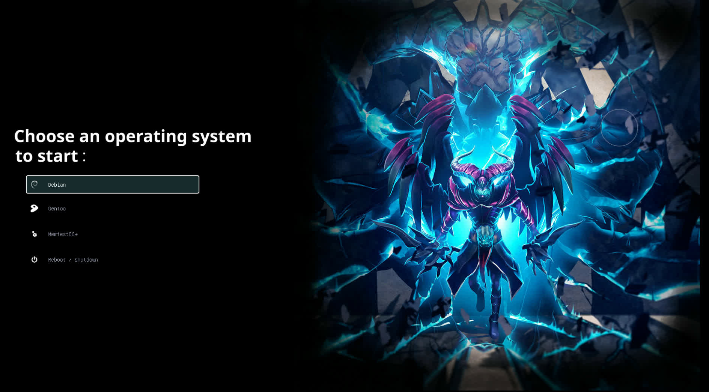
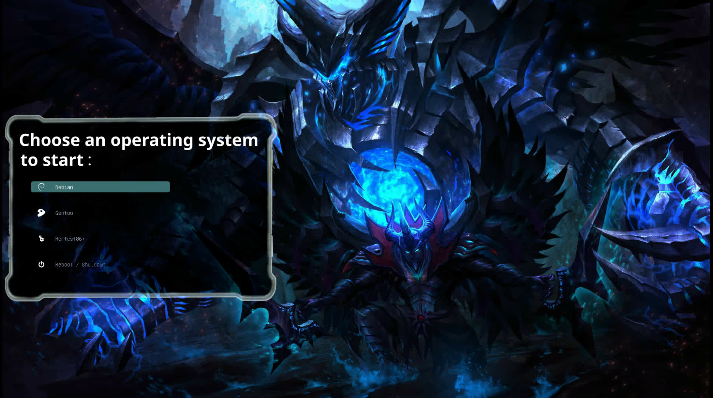

# Grub

------
Copy Theme:
```bash
git clone --depth 1 https://github.com/YujanSubedi/Dota_grub_theme /tmp/grub_theme
sudo cp -r /tmp/grub_theme/Dota /boot/grub/themes/
```

------
Change Theme:
/etc/default/grub
```txt
GRUB_THEME="/boot/grub/themes/Dota/theme.txt"
```

Show log:
remove silent, quiet from /etc/default/grub
```txt
GRUB_CMDLINE_LINUX_DEFAULT=""
```

------
Multi Booting:
```bash
sudo pacman -S --noconfirm --needed os-prober
```

/etc/default/grub
```txt
GRUB_DISABLE_OS_PROBER="false"
```

------
Accept neew grub config:
```bash
grub-mkconfig -o /boot/grub/grub.cfg
```

------
Preview grub theme:

```bash
git clone --depth 1 https://github.com/YujanSubedi/Dota_grub_theme
cd Dota_grub_theme
paru -S --noconfirm --needed grub2-theme-preview || yay -S --noconfirm --needed grub2-theme-preview
grub2-theme-preview --resolution 1920x1080 ./Dota/
```
------

Screenshots:










------
