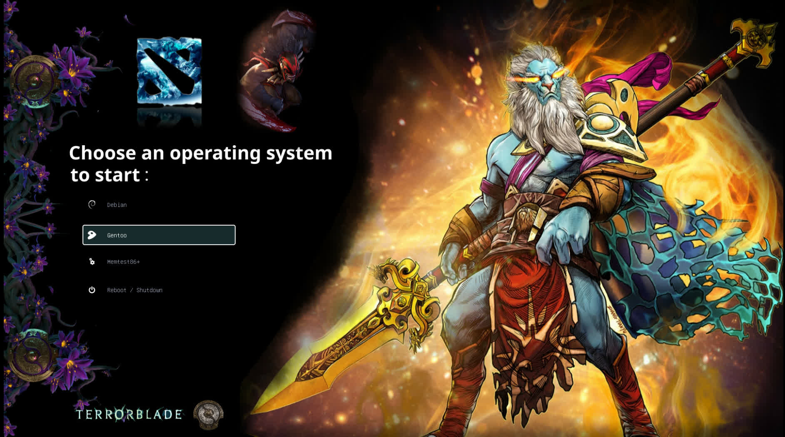
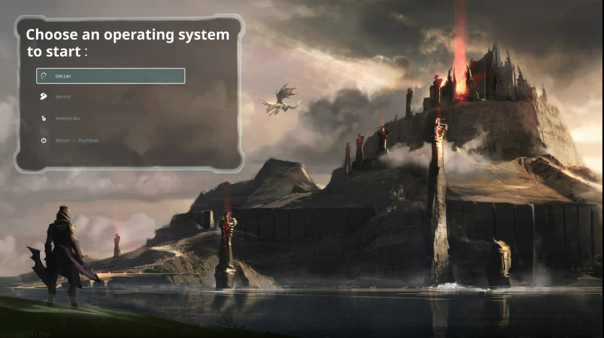
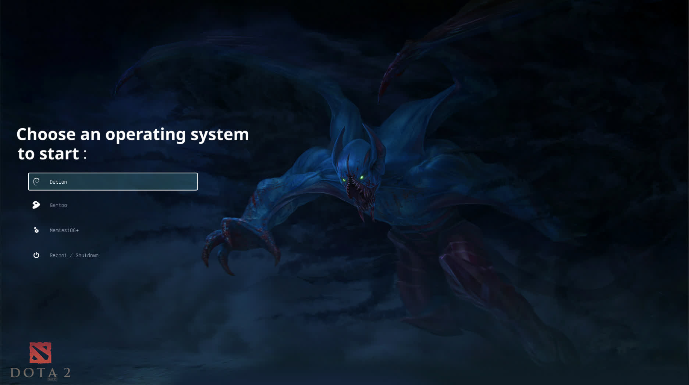
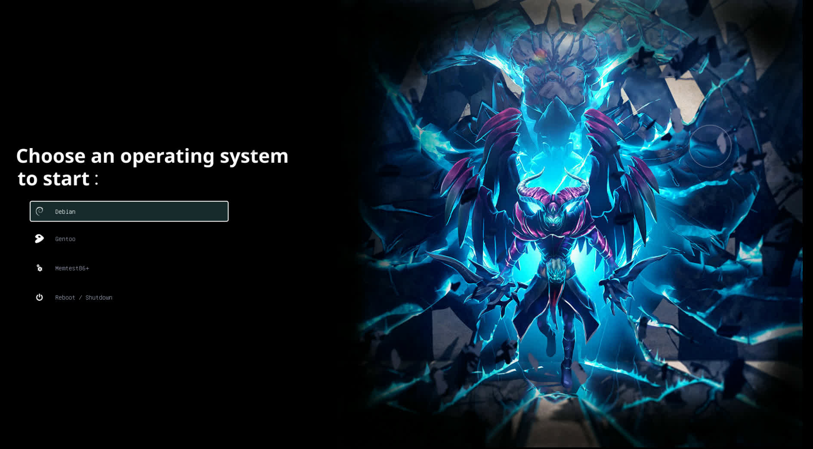
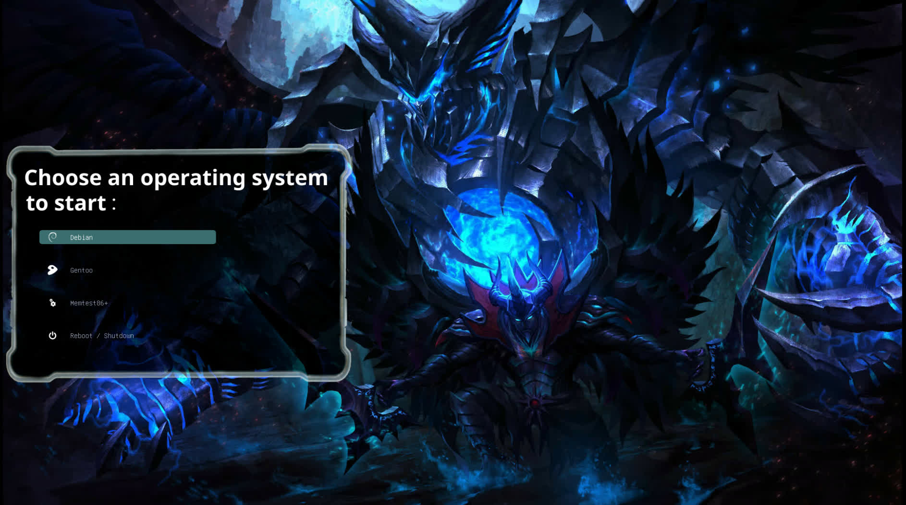

#+author: Yujan Subedi
#+options: toc:nil num:nil html-postamble:nil

*** Grub
Installation:
#+begin_src bash
  sudo pacman -S --noconfirm --needed grub efibootmgr os-oprober
  sudo cp -r ./Dota/ /boot/grub/themes/
#+end_src

#+begin_src bash
  sudoedit /etc/default/grub
#+end_src
#+begin_src text
  GRUB_CMDLINE_LINUX_DEFAULT=""
  GRUB_THEME="/boot/grub/themes/Dota/theme.txt"
  GRUB_DISABLE_OS_PROBER="false"
#+end_src

**** grub customizer
#+begin_src bash
  sudo pacman -S --noconfirm --needed grub-customizer
  grub-customizer
#+end_src

**** Preview grub theme
#+begin_src bash
  paru -S --noconfirm --needed grub2-theme-preview || yay -S --noconfirm --needed grub2-theme-preview
  grub2-theme-preview --resolution 1920x1080 ./Dota/
#+end_src

**** Screenshots

